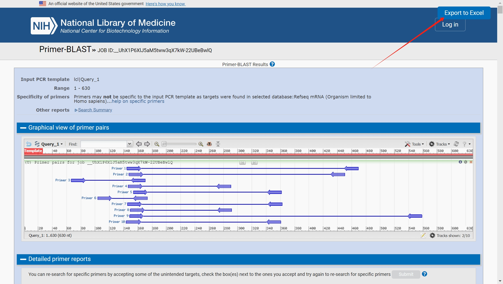
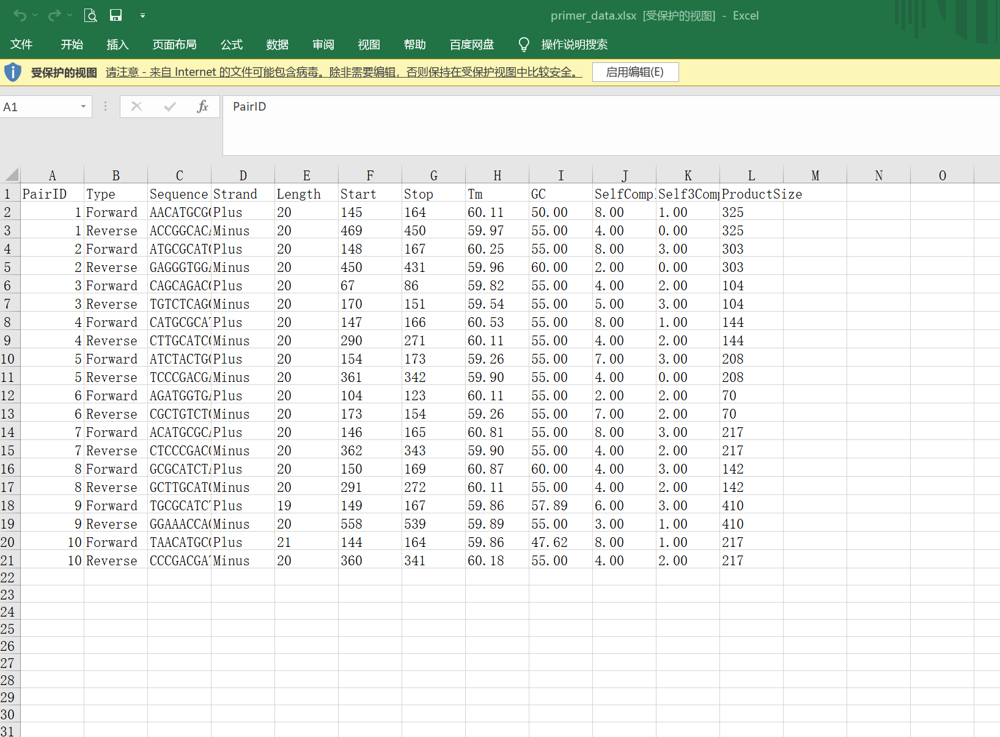

# NCBI-Primer-Data-Extractor-and-Exporter (NCBI primer blast 引物数据提取及导出工具)
This is a Tampermonkey script designed to automatically extract primer data from NCBI Primer-BLAST results and export it to an Excel file. 

这是一个用于自动提取NCBI Primer-BLAST结果中的引物数据，并将其导出为Excel文件的油猴脚本。

## Language / 语言
- [English](#english)
- [中文](#chinese)

## 🔶English 

___This is a Tampermonkey script designed to automatically extract primer data from NCBI Primer-BLAST results and export it to an Excel file___. 

### Features
- Automatically extracts primer data from [NCBI primer blast](https://www.ncbi.nlm.nih.gov/tools/primer-blast/) results, including sequence, length, Tm value, GC content, etc.
- Exports the data to an Excel file for further analysis and record-keeping.

### Usage Instructions
- Make sure your browser has [Tampermonkey](https://www.tampermonkey.net/) or a similar user script manager installed.
- Create a new script in Tampermonkey and copy-paste the script into it. Alternatively, install the script directly from [Greasy Fork](https://greasyfork.org/zh-CN/scripts/494245-ncbi-primer-data-extractor-and-exporter).
- Visit [NCBI Primer-BLAST](https://www.ncbi.nlm.nih.gov/tools/primer-blast/) and design your primers.
- After designing, click the "Export to Excel" button on the page to export the primer data as an Excel file.

### How to Contribute
If you have any improvement suggestions or ideas for adding features, please visit my [github](https://github.com/Xiang-yuZHAO/NCBI-Primer-Data-Extractor-and-Exporter) and contribute in the following ways:
- Submitting a Pull Request.
- Opening a new issue for feature suggestions or bug reports.

## 🔶中文 

___这是一个用于自动提取NCBI Primer-BLAST结果中的引物数据，并将其导出为Excel文件的油猴脚本___。

### 功能
- 自动提取 [NCBI primer blast](https://www.ncbi.nlm.nih.gov/tools/primer-blast/) 结果中的引物数据，包括序列、长度、Tm值、GC含量等。
- 导出数据到Excel文件，方便进行进一步的分析和记录。

### 使用说明
- 确保浏览器已安装 [Tampermonkey](https://www.tampermonkey.net/) 或类似的用户脚本管理器。
- 在 Tampermonkey 中创建一个新脚本，将脚本复制粘贴进去。或者从 [Greasy Fork](https://greasyfork.org/zh-CN/scripts/494245-ncbi-primer-data-extractor-and-exporter) 直接安装脚本。
- 访问 [NCBI Primer-BLAST](https://www.ncbi.nlm.nih.gov/tools/primer-blast/)，进行引物设计。
- 设计完成后，点击页面上的“Export to Excel”按钮，引物数据将被导出为Excel文件。
 

- 表格文件如下。PaidID相同的为配对引物。
 

### 如何贡献
如果您有任何改进意见或功能添加的想法，请访问我的 [github](https://github.com/Xiang-yuZHAO/NCBI-Primer-Data-Extractor-and-Exporter) 并通过以下方式贡献：
- 提交Pull Request。
- 在Issues区域提出新功能建议或报告bug。
